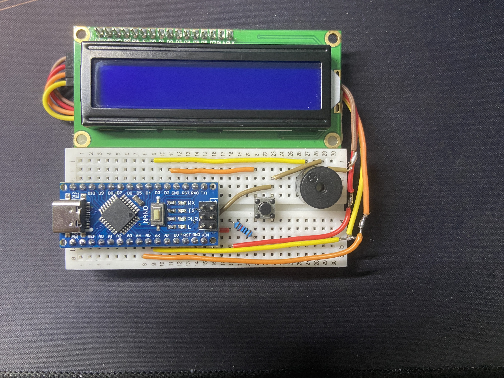
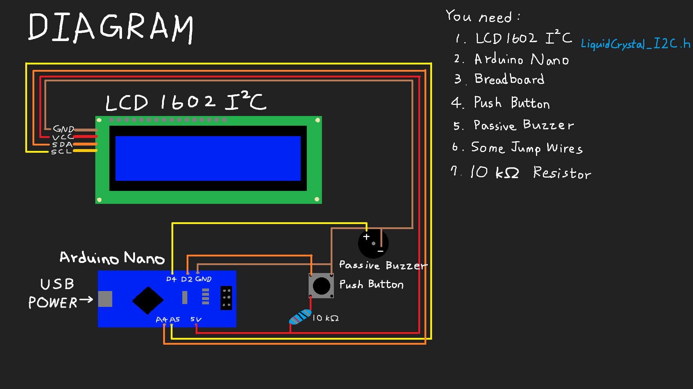

# nano_dino

A Chrome Dino game on **Arduino Nano** with **LCD1602** module.
Featuring 3 different **cactus** (may be consecutive) and **flying birds** as obstacles.

## Gameplay Video
[Showcase](IMG_E2137.MOV)

## Diagram

